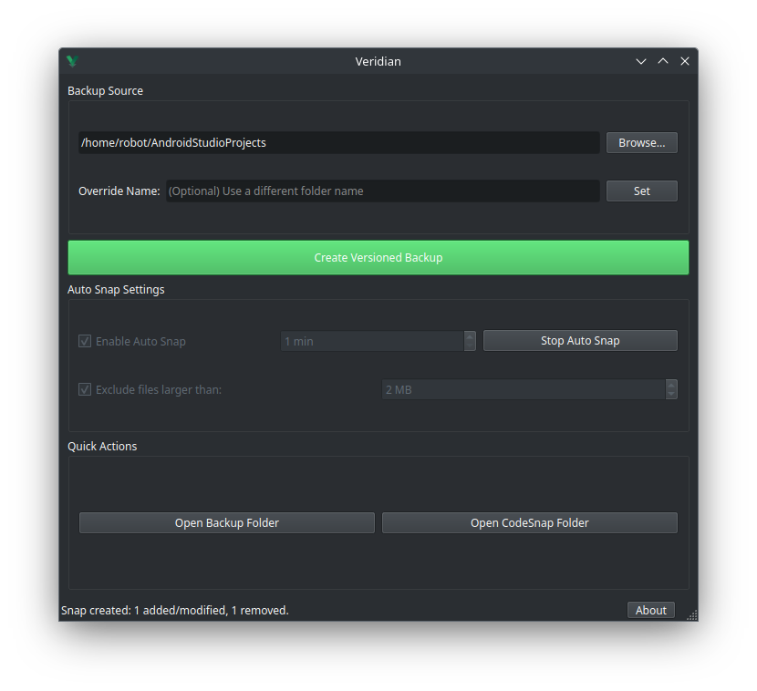
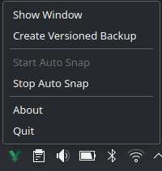
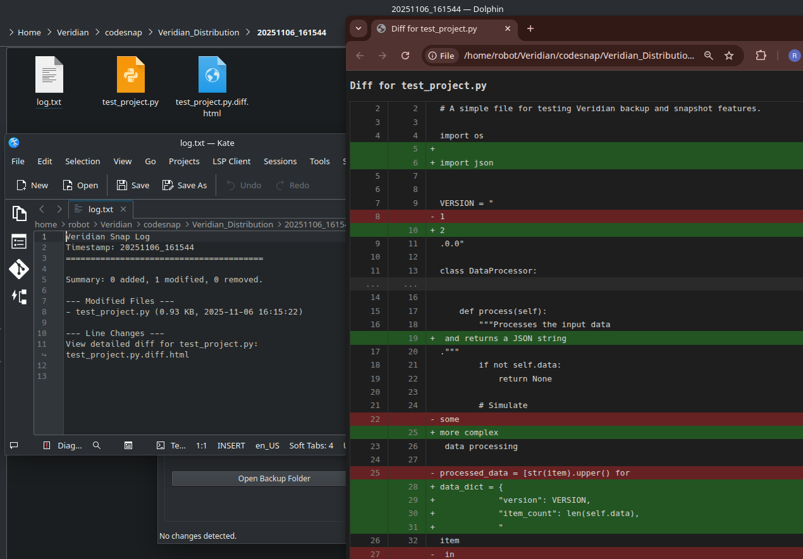

# Veridian
**Version 1.0.0**

<p align="center">
  
</p>

<h3 align="center">Intelligent Backups & Code Snapshots for Developers</h3>

<p align="center">
  Veridian is a professional desktop application designed to safeguard your creative and development work. It provides powerful, easy-to-use tools for creating versioned backups and automated, intelligent code snapshots, ensuring you never lose a moment of progress.
</p>

---

## Features & Walkthrough

Veridian is designed to be simple, powerful, and unobtrusive. Here’s a walkthrough of the core workflow.

### 1. The Control Center

The main window is your central hub for managing all backup and snapshot operations.

<p align="center">
  
</p>

From here, you can:

*   **Select a Source Directory:** Choose the project folder you want to protect.

*   **Create a Versioned Backup:** This is a complete, timestamped copy of your entire project at a specific moment in time. It's perfect for saving major milestones. Veridian is smart and will prevent creating a new backup if no files have changed since the last one, saving disk space.

*   **Configure Auto-Snap:** This is the core feature of Veridian.
    *   **Enable Auto-Snap:** When enabled, Veridian will monitor your project folder.
    *   **Set Interval:** Choose how often you want Veridian to check for changes.
    *   **Exclude Large Files:** A crucial feature to prevent backing up large build artifacts, dependencies (`node_modules`), or data files.

### 2. Always-On Accessibility via the System Tray

Veridian runs discreetly in your system tray, ensuring it's always available but never in your way. A simple right-click gives you immediate access to all essential functions.

<p align="center">
  
</p>

### 3. The Powerful Diff Viewer: See What's Changed

When Auto-Snap saves a snapshot, it does more than just copy files. For any text or code file that has been modified, it generates a beautiful, side-by-side HTML report.

<p align="center">
  
</p>

This allows you to:

*   **Visualize Changes:** See additions (green) and deletions (red) at a glance.
*   **Track History:** Understand the evolution of your code with line numbers and a clean, contextual "hunk" view that only shows the relevant changes.
*   **Work Offline:** The diff reports are self-contained HTML files, viewable in any browser without needing an internet connection.

---

## Installation

### For Linux
1.  Download the `Veridian-x86_64.AppImage` file from the latest [release](https://github.com/Rejwan-Inteser/Veridian/releases).
2.  Make it executable:
    ```bash
    chmod +x Veridian-x86_64.AppImage
    ```
3.  Run it!
    ```bash
    ./Veridian-x86_64.AppImage
    ```

### For Windows
1.  Download the `Veridian.exe` file from the latest [release](https://github.com/Rejwan-Inteser/Veridian/releases).
2.  Run the executable directly by double-clicking it or from the command line.

---

## License

This software is provided as **Freeware**.

**Copyright (c) 2025 Rejwan Inteser. All rights reserved.**

You are free to use this software for any purpose, including commercial use, and to redistribute it freely. However, you are **not** permitted to modify, reverse-engineer, sell, or claim the original work as your own. Please see the [LICENSE](LICENSE) file for full details.

---
